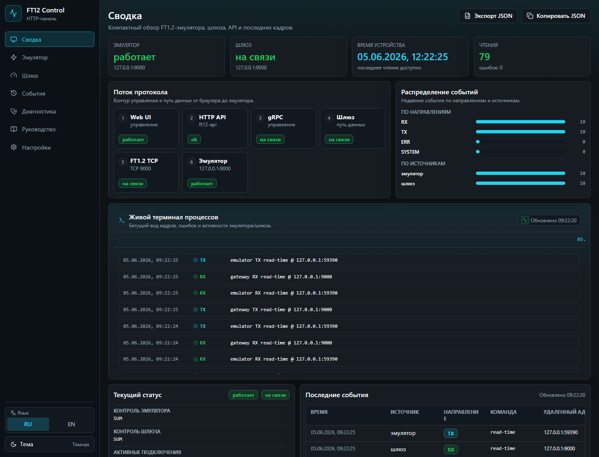
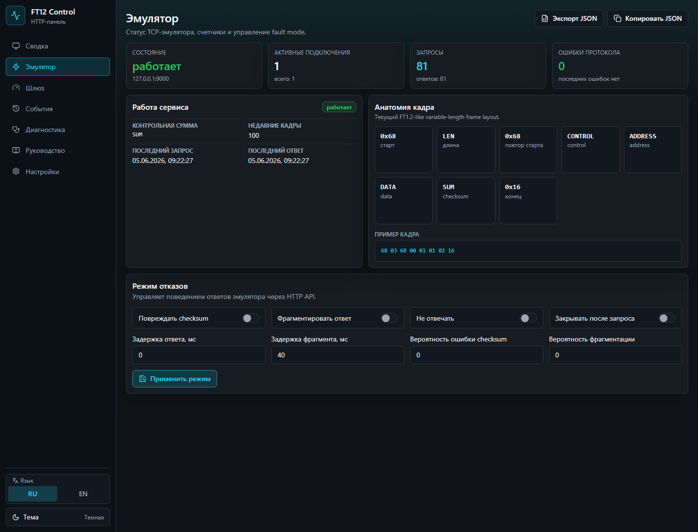
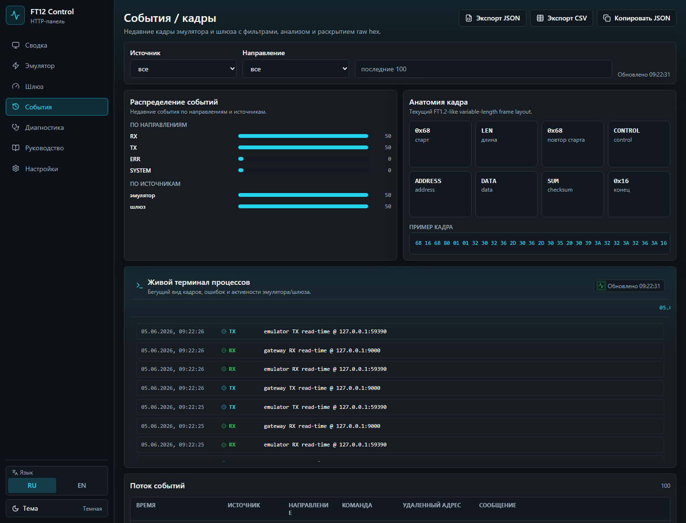
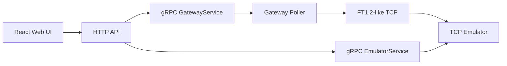

# TTRON TTR20 Time / FT1.2 Protocol Platform

[](https://github.com/dimbo1324/ttron-ttr20-time-r/actions/workflows/ci.yml)

Local industrial protocol simulation platform for an FT1.2-like/TTR20
time-reading workflow. It lets you run a TCP device emulator, watch a gateway
poll the device, inspect raw protocol frames, switch fault modes, export
diagnostics, and see the whole process in a bilingual Web UI.

The project combines a Go protocol core, TCP emulator, gateway polling service,
gRPC control plane, HTTP/JSON API, React Web UI, Docker Compose runtime, CI
quality gates, a small observability baseline, local analysis exports, compact
protocol infographics, and a live process terminal.

## Demo

Real screenshots are stored under `docs/assets/screenshots/`. They show the
actual local Docker/Web UI smoke environment, not mockups.





## What You Can Do In The UI

| Area | What it helps with |
| --- | --- |
| Dashboard | See emulator/gateway health, device time, event distribution, protocol flow, and the live process terminal. |
| Emulator | Toggle fault modes such as delayed responses, fragmented frames, checksum corruption, no-response, and close-after-request. |
| Gateway | Start/stop polling, inspect connection state, backoff/reconnect counters, and the latest read-time cycle. |
| Events | Filter RX/TX/ERR/SYSTEM frames, expand raw hex, export JSON/CSV, and watch the terminal-style event feed. |
| Diagnostics | Check health/readiness, service counters, metrics summary, and export operational snapshots. |

## Architecture



The FT1.2-like TCP path stays separate from the HTTP/Web control surface. The
HTTP API talks to emulator and gateway through the existing gRPC clients; the
Web UI talks only to `/api`.

## Features

- FT1.2-like variable-length frame encoder/decoder.
- Additive checksum (`sum`) and CRC-16/Modbus modes.
- Streaming parser for fragmented TCP frames.
- Read-time command model and high-level codec helpers.
- TCP emulator with fault modes, sessions, status counters, and recent events.
- Gateway poller with reconnect/backoff and start/stop controls.
- gRPC control APIs for emulator and gateway.
- HTTP/JSON API with health, readiness, events, controls, metrics, and JSON/CSV exports.
- React/Vite/TypeScript/Tailwind dashboard with Russian-by-default and English UI.
- Persisted dark/light themes for the local dashboard.
- Compact responsive Web UI for laptop and desktop monitoring.
- Polished container-safe UI primitives for wrapped labels, stable buttons,
  readable badges, detail lists, and non-overlapping protocol tiles.
- Protocol flow, frame anatomy, polling timeline, and event distribution infographics.
- Live process terminal with a running event ticker and recent frame log.
- Smooth button press feedback, hover tooltips, and action result notices for
  controls and exports.
- Events export as JSON/CSV plus overview and service status JSON exports.
- Docker Compose stack with nginx static serving and API proxy.
- Non-root container runtimes and service healthchecks.
- Optional Prometheus scrape profile.
- GitHub Actions CI across Go, frontend, Docker, architecture, and race tests.
- Architecture boundary scripts and local release checks.
- Runtime logs under ignored `runtime/logs/` and cleanup scripts for local build
  output.

## Quick Start

Run the full local stack:

```powershell
docker compose up --build
```

Open:

- Web UI: `http://localhost:5173`
- API health: `http://localhost:8080/health`
- API readiness: `http://localhost:8080/api/v1/ready`
- API metrics: `http://localhost:8080/metrics`
- Events CSV export: `http://localhost:8080/api/v1/export/events.csv`
- Overview JSON export: `http://localhost:8080/api/v1/export/overview.json`

Open the Dashboard first. The live terminal shows the running RX/TX/ERR stream
while the gateway polls the emulator. Use the Emulator page to introduce faults,
then return to Dashboard or Events to see how the system reacts.
Sections are also deep-linkable with hash URLs such as
`http://localhost:5173/#events` and `http://localhost:5173/#emulator`.

Optional Prometheus:

```powershell
docker compose --profile observability up --build
```

Open `http://localhost:9090`.

Stop the stack:

```powershell
docker compose down -v
```

## Local Development

Backend checks:

```powershell
go fmt ./...
.\scripts\check-go-format.ps1
go test ./...
go build ./...
.\scripts\check-architecture.ps1
```

Run services manually:

```powershell
go run ./cmd/ft12-emulator -listen 127.0.0.1:9000 -mode sum -grpc-listen 127.0.0.1:9100
go run ./cmd/ft12-gateway -target 127.0.0.1:9000 -mode sum -interval 1s -grpc-listen 127.0.0.1:9200
go run ./cmd/ft12-api -http-listen 127.0.0.1:8080 -emulator-grpc 127.0.0.1:9100 -gateway-grpc 127.0.0.1:9200
```

Frontend development:

```powershell
cd web
npm ci
npm run dev
```

Open `http://localhost:5173`. Vite proxies `/api` and `/health` to the local
API on `localhost:8080`. The UI starts in Russian, can switch to English, and
stores language/theme choices in browser `localStorage`.

Release-style local check:

```powershell
.\scripts\release-check.ps1
```

Local service logs default to:

- `runtime/logs/ft12-emulator.log`
- `runtime/logs/ft12-gateway.log`
- `runtime/logs/ft12-api.log`

Use `-log=` to keep a service on stdout, or pass another `-log` path for local
diagnostics. `runtime/`, `tmp/`, logs, `web/dist`, and similar generated output
are ignored by Git. Cleanup helpers:

```powershell
.\scripts\clean-runtime.ps1 -DryRun
.\scripts\clean-runtime.ps1
```

```sh
bash scripts/clean-runtime.sh --dry-run
bash scripts/clean-runtime.sh
```

## Service Ports

| Service | Purpose | Host port |
| --- | --- | --- |
| `ft12-emulator` | FT1.2-like TCP data path | `9000` |
| `ft12-emulator` | gRPC control | `9100` |
| `ft12-gateway` | gRPC control | `9200` |
| `ft12-api` | HTTP/JSON API, health, readiness, metrics | `8080` |
| `ft12-web` | nginx static Web UI and `/api` proxy | `5173` |
| `prometheus` | optional metrics scrape profile | `9090` |

## Project Structure

```text
cmd/        command entrypoints
internal/   Go packages for protocol, services, API, config, platform helpers
proto/      protobuf/gRPC contract sources
web/        React/Vite dashboard and nginx runtime image
deploy/     Docker and observability assets
docs/       architecture, protocol, operations, release, examples
scripts/    architecture, docs-link, and release-check scripts
legacy/     retained reference implementations
task/       original assignment documents
```

## Documentation

- [Documentation index](docs/index.md)
- [Architecture](docs/architecture.md)
- [Protocol](docs/protocol.md)
- [Emulator](docs/emulator.md)
- [Gateway](docs/gateway.md)
- [gRPC API](docs/grpc-api.md)
- [HTTP API](docs/http-api.md)
- [Web UI](docs/web-ui.md)
- [Docker](docs/docker.md)
- [Observability](docs/observability.md)
- [CI](docs/ci.md)
- [Development](docs/development.md)
- [Testing](docs/testing.md)
- [Troubleshooting](docs/troubleshooting.md)
- [Examples](docs/examples.md)
- [Release](docs/release.md)
- [Security notes](docs/security-notes.md)
- [Repository checklist](docs/repository-checklist.md)
- [Roadmap](docs/roadmap.md)
- [Legacy](docs/legacy.md)

## Safety And Production Notes

This is a simulation, learning, and portfolio platform. It is not certified for
direct control of real industrial equipment. There is no authentication, TLS,
persistence, production secrets management, or hardened public deployment
profile yet. Do not expose the API, Web UI, or gRPC ports to untrusted networks
without additional review and hardening. Exported JSON/CSV files may contain
protocol diagnostic data, raw frame hex, endpoint addresses, and service
counters; treat them as local troubleshooting artifacts.

## Contributing And Security

See [CONTRIBUTING.md](CONTRIBUTING.md) for local setup and quality gates. See
[SECURITY.md](SECURITY.md) for reporting guidance and current security scope.

## License

MIT. See [LICENSE](LICENSE). Third-party dependencies are managed through
`go.mod`, `go.sum`, `web/package.json`, and `web/package-lock.json`.
