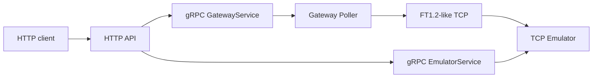

# TTRON TTR20 Time / FT1.2 Protocol Platform

[](https://github.com/dimbo1324/ttron-ttr20-time-r/actions/workflows/ci.yml)

Local industrial protocol simulation platform for an FT1.2-like/TTR20
time-reading workflow. It lets you run a TCP device emulator, watch a gateway
poll the device, inspect raw protocol frames, switch fault modes, export
diagnostics, and drive everything through an HTTP/JSON API.

The project combines a Go protocol core, TCP emulator, gateway polling service,
gRPC control plane, HTTP/JSON API, Docker Compose runtime, CI
quality gates, a small observability baseline, local analysis exports, compact
protocol documentation.

## What You Can Do Through The API

| Area | What it helps with |
| --- | --- |
| Overview | Read emulator/gateway health, device time, and event distribution. |
| Emulator | Toggle fault modes such as delayed responses, fragmented frames, checksum corruption, no-response, and close-after-request. |
| Gateway | Start/stop polling, inspect connection state, backoff/reconnect counters, and the latest read-time cycle. |
| Events | Filter RX/TX/ERR/SYSTEM frames, read raw hex, and export JSON/CSV. |
| Diagnostics | Check health/readiness, service counters, metrics summary, and export operational snapshots. |

## Architecture


```mermaid
flowchart LR
  Client["HTTP client"] --> API["HTTP API"]
  API --> EG["gRPC EmulatorService"]
  API --> GG["gRPC GatewayService"]
  Gateway["Gateway Poller"] --> TCP["FT1.2-like TCP"]
  TCP --> Emulator["TCP Emulator"]
  EG --> Emulator
  GG --> Gateway
```

The FT1.2-like TCP path stays separate from the HTTP control surface. The
HTTP API talks to emulator and gateway through the existing gRPC clients.

## Features

- FT1.2-like variable-length frame encoder/decoder.
- Additive checksum (`sum`) and CRC-16/Modbus modes.
- Streaming parser for fragmented TCP frames.
- Read-time command model and high-level codec helpers.
- TCP emulator with fault modes, sessions, status counters, and recent events.
- Gateway poller with reconnect/backoff and start/stop controls.
- gRPC control APIs for emulator and gateway.
- HTTP/JSON API with health, readiness, events, controls, metrics, and JSON/CSV exports.
- Events export as JSON/CSV plus overview and service status JSON exports.
- Docker Compose stack for emulator, gateway, and API services.
- Non-root container runtimes and service healthchecks.
- Optional Prometheus scrape profile.
- GitHub Actions CI across Go, Docker, architecture, and race tests.
- Architecture boundary scripts and local release checks.
- Runtime logs under ignored `runtime/logs/` and cleanup scripts for local build
  output.

## Quick Start

Run the full local stack:

```powershell
docker compose up --build
```

Open:

- API health: `http://localhost:8080/health`
- API readiness: `http://localhost:8080/api/v1/ready`
- API metrics: `http://localhost:8080/metrics`
- Events CSV export: `http://localhost:8080/api/v1/export/events.csv`
- Overview JSON export: `http://localhost:8080/api/v1/export/overview.json`

Start with `/api/v1/overview` while the gateway polls the emulator. Use the
emulator control endpoints to introduce faults, then read `/api/v1/events` to
see how the system reacts.

Optional Prometheus:

```powershell
docker compose --profile observability up --build
```

Open `http://localhost:9090`.

Stop the stack:

```powershell
docker compose down -v
```

## Local Development

Backend checks:

```powershell
go fmt ./...
.\scripts\check-go-format.ps1
go test ./...
go build ./...
.\scripts\check-architecture.ps1
```

Run services manually:

```powershell
go run ./cmd/ft12-emulator -listen 127.0.0.1:9000 -mode sum -grpc-listen 127.0.0.1:9100
go run ./cmd/ft12-gateway -target 127.0.0.1:9000 -mode sum -schedule interval -interval 1s -grpc-listen 127.0.0.1:9200
go run ./cmd/ft12-api -http-listen 127.0.0.1:8080 -emulator-grpc 127.0.0.1:9100 -gateway-grpc 127.0.0.1:9200
```

Release-style local check:

```powershell
.\scripts\release-check.ps1
```

Local service logs default to:

- `runtime/logs/ft12-emulator.log`
- `runtime/logs/ft12-gateway.log`
- `runtime/logs/ft12-api.log`

Use `-log=` to keep a service on stdout, or pass another `-log` path for local
diagnostics. `runtime/`, `tmp/`, logs, and similar generated output
are ignored by Git. Cleanup helpers:

```powershell
.\scripts\clean-runtime.ps1 -DryRun
.\scripts\clean-runtime.ps1
```

```sh
bash scripts/clean-runtime.sh --dry-run
bash scripts/clean-runtime.sh
```

## Service Ports

| Service | Purpose | Host port |
| --- | --- | --- |
| `ft12-emulator` | FT1.2-like TCP data path | `9000` |
| `ft12-emulator` | gRPC control | `9100` |
| `ft12-gateway` | gRPC control | `9200` |
| `ft12-api` | HTTP/JSON API, health, readiness, metrics | `8080` |
| `prometheus` | optional metrics scrape profile | `9090` |

## Project Structure

```text
cmd/        command entrypoints
internal/   Go packages for protocol, services, API, config, platform helpers
proto/      protobuf/gRPC contract sources
deploy/     Docker and observability assets
docs/       architecture, protocol, operations, release, examples
scripts/    architecture, docs-link, and release-check scripts
legacy/     retained reference implementations
task/       original assignment documents
```

## Documentation

- [Documentation index](docs/index.md)
- [Architecture](docs/architecture.md)
- [Protocol](docs/protocol.md)
- [Emulator](docs/emulator.md)
- [Gateway](docs/gateway.md)
- [gRPC API](docs/grpc-api.md)
- [HTTP API](docs/http-api.md)
- [Docker](docs/docker.md)
- [Observability](docs/observability.md)
- [CI](docs/ci.md)
- [Development](docs/development.md)
- [Testing](docs/testing.md)
- [Troubleshooting](docs/troubleshooting.md)
- [Examples](docs/examples.md)
- [Release](docs/release.md)
- [Security notes](docs/security-notes.md)
- [Repository checklist](docs/repository-checklist.md)
- [Roadmap](docs/roadmap.md)
- [Legacy](docs/legacy.md)

## Safety And Production Notes

This is a simulation, learning, and portfolio platform. It is not certified for
direct control of real industrial equipment. There is no authentication, TLS,
persistence, production secrets management, or hardened public deployment
profile yet. Do not expose the API or gRPC ports to untrusted networks
without additional review and hardening. Exported JSON/CSV files may contain
protocol diagnostic data, raw frame hex, endpoint addresses, and service
counters; treat them as local troubleshooting artifacts.

## Contributing And Security

See [CONTRIBUTING.md](CONTRIBUTING.md) for local setup and quality gates. See
[SECURITY.md](SECURITY.md) for reporting guidance and current security scope.

## License

MIT. See [LICENSE](LICENSE). Third-party dependencies are managed through
`go.mod` and `go.sum`.
