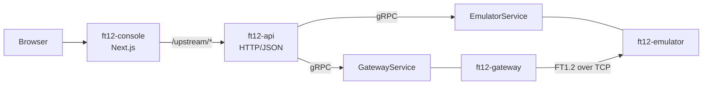

# TTRON TTR20 Time / FT1.2 Protocol Platform

[](https://github.com/dimbo1324/ttron-ttr20-time-r/actions/workflows/ci.yml)
[](https://github.com/dimbo1324/ttron-ttr20-time-r/actions/workflows/security.yml)

A bench for an industrial time-reading protocol. It runs a TCP device
emulator, a gateway that polls it over an FT1.2-like wire format, a gRPC
control plane, an HTTP/JSON API, and a web console that shows the whole
exchange frame by frame.


## The brief

> Write a program in Go that, on the fifth second of every minute, reads the
> device's date and time over FT1.2 through a TTR20 teleport, and logs it.

```sh
go run ./cmd/ft12-gateway
```

With no flags, that is exactly what it does: the shipped default is an aligned
schedule of one minute at an offset of five seconds. Everything else in this
repository is scope taken on deliberately, to make the answer a bench someone
can learn the protocol on rather than a script — see
[the roadmap](docs/roadmap.md) for the line between the two.

## Quick start

```sh
docker compose up --build
```

| | |
| --- | --- |
| Console | `http://localhost:3000/en` (or `/ru`) |
| API health | `http://localhost:8080/health` |
| API readiness | `http://localhost:8080/api/v1/ready` |
| Metrics | `http://localhost:8080/metrics` |

Stop it:

```sh
docker compose down -v
```

The console opens on the **bench** — a working model of the device, the line
and the gateway running in the browser, which needs no backend at all. Flip
the switch in the header to **Live stack** and the same page reads the Go
services that Compose just started. [Take the tour](docs/tour.md).

## What is in here


```mermaid
flowchart LR
  Browser["Browser"] --> Console["ft12-console<br/>Next.js"]
  Console -- "/upstream/*" --> API["ft12-api<br/>HTTP/JSON"]
  API -- gRPC --> EmulatorCtl["EmulatorService"]
  API -- gRPC --> GatewayCtl["GatewayService"]
  EmulatorCtl --- Emulator["ft12-emulator"]
  GatewayCtl --- Gateway["ft12-gateway"]
  Gateway -- "FT1.2 over TCP" --> Emulator
```

The device data path and the control surface are separate: FT1.2 frames only
ever travel between the gateway and the device, and everything a human touches
goes the other way round through gRPC and HTTP.

**Protocol core** (`internal/protocol`) — the FT1.2-like variable-length
frame, additive and CRC-16/Modbus checksums, a streaming parser for fragmented
TCP, and a command registry carrying read-time and read-identity. It depends
on nothing but the standard library.

**Emulator** (`cmd/ft12-emulator`) — a TCP device with fault modes: a late
answer, a broken checksum on a share of answers, an answer arriving in pieces,
silence, and a connection dropped after the request.

**Gateway** (`cmd/ft12-gateway`) — the polling service, and the part that
reasons rather than only performs:

- wall-clock **aligned scheduling**, so poll instants survive restarts and
  reconnects instead of drifting by however long each reply took;
- **in-session retries** kept separate from reconnects — a frame error is
  retried on the same connection, the link is dropped only on a transport
  failure;
- **clock skew** classified on a median rather than the last sample, with a
  least-squares drift rate and the R² of that fit;
- **device health** with hysteresis and latency percentiles, so one slow poll
  is not an outage;
- a **device inventory**, so one gateway polls a fleet, each device with its
  own schedule and thresholds.

**Control plane** (`cmd/ft12-api`, `internal/api`) — gRPC between services,
HTTP/JSON outward. Status, the rolling history windows, the fleet, event
export as JSON and CSV, and settings that reconfigure a gateway that is
already polling.

**Console** (`web/`) — Next.js, TypeScript, Russian and English. A frame
analyzer, an exchange monitor, a dashboard, fault controls, gateway settings,
and a protocol reference written from first principles.

**The repository's own checks** (`tools/checks`) — dependency boundaries read
from the real import graph, formatting, documentation links, artefact cleanup
and a release gate, as one Go command.

## Local development

```sh
go run ./tools/checks release   # format, boundaries, doc links, vet, test, build
go test ./...
make verify
```

Run the services by hand, each in its own terminal:

```sh
go run ./cmd/ft12-emulator -listen 127.0.0.1:9000 -grpc-listen 127.0.0.1:9100
go run ./cmd/ft12-gateway  -target 127.0.0.1:9000 -grpc-listen 127.0.0.1:9200
go run ./cmd/ft12-api      -http-listen 127.0.0.1:8080 -emulator-grpc 127.0.0.1:9100 -gateway-grpc 127.0.0.1:9200
```

The console:

```sh
pnpm --dir web install
pnpm --dir web dev
```

See [Development](docs/development.md) for the full set, including coverage
and the frontend checks.

## Service ports

| Service | Purpose | Host port |
| --- | --- | --- |
| `ft12-emulator` | FT1.2-like TCP data path | `9000` |
| `ft12-emulator` | gRPC control | `9100` |
| `ft12-gateway` | gRPC control | `9200` |
| `ft12-api` | HTTP/JSON API, health, readiness, metrics | `8080` |
| `ft12-console` | web console | `3000` |
| `prometheus` | optional metrics scrape profile | `9090` |

## Project structure

```text
cmd/        command entrypoints
internal/   protocol core, services, API adapters, config, platform helpers
proto/      protobuf/gRPC contract sources
web/        the Next.js console
deploy/     Dockerfiles and observability assets
docs/       architecture, protocol, operations, release, the visual tour
tools/      the repository's own checks, and the documentation's screenshots
examples/   frames, HTTP calls, device inventories
legacy/     retained reference implementations
task/       the original assignment documents
```

## Documentation

Start with the [documentation index](docs/index.md), or:

| | |
| --- | --- |
| [Tour](docs/tour.md) | what the console looks like and does |
| [Architecture](docs/architecture.md) | services, boundaries, and what depends on what |
| [Protocol](docs/protocol.md) | the frame format, checksums, commands, the time-zone trap |
| [Gateway](docs/gateway.md) | schedules, retries, inventories |
| [Emulator](docs/emulator.md) | the device and its fault modes |
| [HTTP API](docs/http-api.md) | endpoints, status shapes, exports |
| [gRPC API](docs/grpc-api.md) | the internal control plane |
| [Console](docs/console.md) | the two sources, and what live mode can change |
| [Docker](docs/docker.md) | the Compose stack, the proxy, the images |
| [CI](docs/ci.md) | what runs on every push |
| [Development](docs/development.md) | commands, checks, coverage |
| [Testing](docs/testing.md) | what is covered, and how to run it |
| [Observability](docs/observability.md) | health, readiness, metrics |
| [Troubleshooting](docs/troubleshooting.md) | the failures that actually happen |
| [Release](docs/release.md) | cutting a version |
| [Security notes](docs/security-notes.md) | what is and is not hardened |
| [Roadmap](docs/roadmap.md) | delivered, and deliberately not built |

## Safety and production notes

This is a simulation, learning and portfolio platform. It is not certified for
control of real industrial equipment. There is no authentication, TLS,
persistence, secrets management or hardened deployment profile. Do not expose
the API, the gRPC ports or the emulator's TCP port to untrusted networks
without additional review and hardening.

Exported JSON and CSV may contain protocol diagnostic data, raw frame hex,
endpoint addresses and service counters. Treat them as local troubleshooting
artefacts.

## Contributing and security

See [CONTRIBUTING.md](CONTRIBUTING.md) for setup and the quality gates, and
[SECURITY.md](SECURITY.md) for reporting guidance and the current security
scope.

## License

MIT. See [LICENSE](LICENSE). Third-party dependencies are managed through
`go.mod`, `go.sum` and `web/pnpm-lock.yaml`.
