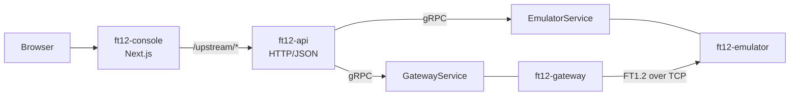

# Architecture

Four processes and a browser. Two directions of traffic that never mix: FT1.2
frames travel between the gateway and the device, and everything a human
touches travels the other way round, through gRPC between services and
HTTP/JSON outward.



Keeping them apart is what lets the protocol core stay a library: nothing in
`internal/protocol` knows that an HTTP API exists, and nothing in the HTTP API
re-implements a checksum.

## The processes

`cmd/ft12-emulator` is the device. It accepts TCP connections, parses frames
with the protocol core, answers read-time and read-identity, applies whatever
fault mode it has been told to, and keeps in-memory counters and a recent
event ring.

`cmd/ft12-gateway` is the poller. It connects to a device, reads its clock on
a schedule, parses the answer, and reconnects with backoff. What it does
around that is described in [Gateway](gateway.md): aligned scheduling,
in-session retries, skew and drift, availability with hysteresis, and a device
inventory.

`cmd/ft12-api` is a thin HTTP/JSON adapter over the gRPC control plane. It
holds no protocol logic and no polling logic; it maps DTOs.

`cmd/ft12-console` does not exist, because the console is not a Go process —
it is the Next.js app under `web/`, built into a standalone server image. See
[Docker](docker.md).

`cmd/ft12-client` is a direct polling demo, `cmd/ft12-cli` a placeholder for
local inspection tools, and `cmd/ft12-healthcheck` the one health probe every
container image carries — the runtime images are distroless and have neither a
shell nor curl.

## The domain packages

The gateway's reasoning lives in packages of its own rather than inside the
polling loop, so each can be tested against a table of inputs instead of
against a running device:

| Package | Answers |
| --- | --- |
| `internal/schedule` | when the next poll should happen |
| `internal/retry` | how many attempts a frame error is worth, and how far apart |
| `internal/clock` | how far off the device's clock is, and which way it is going |
| `internal/health` | whether the device is up, given that one bad poll is not an outage |
| `internal/devices` | which devices this gateway is responsible for |

`internal/protocol` holds the wire format itself — `checksum`, `frame`,
`command`, `codec` — and depends only on the standard library.

## The adapter layers

Generated protobuf lives under `internal/api/grpc/ft12/v1`. Handwritten gRPC
servers (`internal/api/grpc/{emulator,gateway}`) map service snapshots into
those messages through one shared mapper, `internal/api/grpc/mapping`, so
checksum, direction, timestamp and service-state translation exists once.

The HTTP layer under `internal/api/http` depends on small interfaces satisfied
by the gRPC clients. It does not import the emulator or gateway service
packages, which is checked rather than merely intended.

Process bootstrap is separate from both: `internal/app/{emulatorapp,
gatewayapp, apiapp, clientapp, cliapp}` own flags, wiring and lifecycle, so
the `cmd/` entrypoints stay a `main` that calls one function.
`internal/platform/lifecycle` runs the concurrent runners and propagates the
first error.

## Dependency rules

```text
cmd/ft12-emulator -> internal/app/emulatorapp -> internal/emulator -> internal/transport/tcp -> internal/protocol
cmd/ft12-gateway  -> internal/app/gatewayapp  -> internal/gateway  -> internal/transport/tcp -> internal/protocol
cmd/ft12-client   -> internal/client   -> internal/protocol
app/* gRPC wiring -> internal/api/grpc  -> internal/{emulator,gateway}
cmd/ft12-api      -> internal/app/apiapp -> internal/api/http -> internal/api/grpc/client
```

The rules the compiler cannot express are enforced by the repository's own
check:

```sh
go run ./tools/checks architecture
```

It reads the real import graph from `go list`, so a forbidden package reached
through two intermediate hops fails as clearly as a direct import, and the
failure names the chain and the line the first hop is written on. Production
code is checked transitively; test files are checked for direct imports only.

What it enforces:

- `internal/protocol` imports nothing but the standard library — not
  transports, config, logging, the service packages, the gRPC adapters or any
  future adapter layer;
- `internal/emulator` and `internal/gateway` do not import each other;
- `internal/api/http` does not import the service packages;
- nothing under `cmd/`, `internal/` or `proto/` imports `legacy/`.

See [Dependency rules](architecture/dependency-rules.md) for the reasoning and
[ADR 0005](architecture/decisions/0005-architecture-hardening-before-web-ui.md)
for why the boundaries were drawn before the console was written rather than
after.

## The console

`web/` is a Next.js app, and its two data sources are a real architectural
seam rather than a demo toggle. Both implement the same `Telemetry` interface:
one from a browser-side model of the protocol, one from the HTTP API. The
pages consume the interface and cannot tell which is behind it.

The browser talks only to the console's own origin. `/upstream/*` is forwarded
to the API by a route handler — deliberately not a `rewrites()` entry, for a
reason [Docker](docker.md) explains — which keeps the API off the public
network and removes CORS from the picture.

## Not a metrics stack

`internal/observability/events` is a small in-memory ring of recent events
with stable monotonic IDs. The IDs are stable because an HTTP adapter needs an
event to keep its identity between two reads, which slice positions do not
give. It is not storage and it is not a metrics system; see
[Observability](observability.md) for what is actually exposed.
