# A Tour Of The Console

Everything on this page is a photograph of the running project, taken by
[tools/docmedia](../tools/docmedia/README.md) against a live stack. Nothing
here is a mockup.

The console is a Next.js app under `web/`. It reads from one of two sources,
chosen by the switch in the top right, and the choice changes what every
number on the page means:

- **Bench** — a working model of the device, the line and the gateway, running
  entirely in the browser. Nothing needs to be installed. This is the teaching
  mode, and the one these first screenshots are taken in.
- **Live stack** — the same console reading a running Go stack over the HTTP
  API. Every number then comes from the real gateway and the real device.

The interface ships in Russian and English (`/ru`, `/en`). The screenshots are
English.

---

## Overview

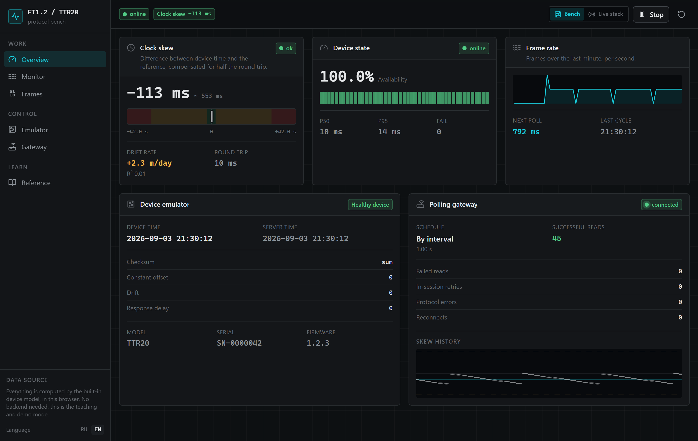

The headline figure is clock skew, because that is what the brief is about: a
meter stamps every consumption record from its own clock, so a clock that
wanders shifts the whole archive with it.

Skew is signed — positive means the device reads ahead — and it is judged on
the *median* of a window rather than on the last sample, because one sample
carries the whole round trip with it. Beside it, the drift rate is a
least-squares fit over that window, and R² is printed next to it so a rate
computed from noise can be recognised as one.

`Device state` is availability with hysteresis, not a ping: a device is not
called degraded until it has failed a set number of polls in a row, and not
called healthy again until it has succeeded a set number in a row. P50 and P95
are the latencies that decision was made on.

## Monitor

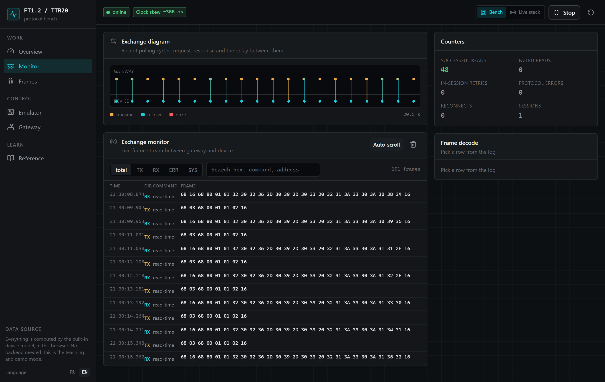

Every frame in both directions, with its raw hex, the command it carries and
how long the answer took. `TX` and `RX` come in pairs because the line is
master–slave: the next request does not go out until the answer arrives or the
timeout expires.

`SYS` rows are the bench narrating itself — a state change, a reconnect, a
poll starting. `ERR` is no answer, or one that arrived damaged.

Watching it run is most of what the page is for:

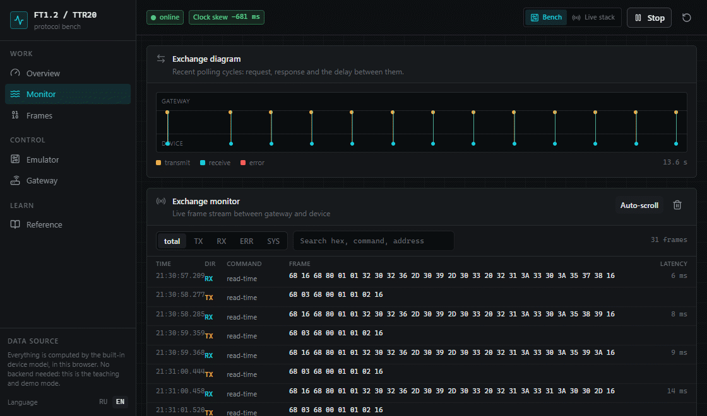

## Frames

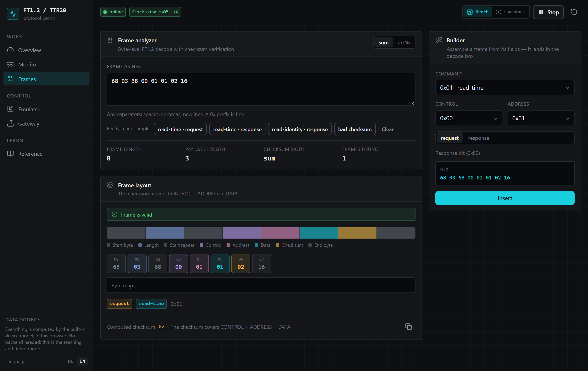

Paste hex, get a decode: field boundaries, the meaning of every byte, and a
checksum verified rather than assumed. The samples along the top include a
deliberately broken one.

The builder on the right runs the same code backwards — pick a command, a
control byte and an address, and it assembles the frame. A frame copied out of
the monitor decodes here identically, because both use the same TypeScript
implementation of the format described in [protocol.md](protocol.md).

## Emulator

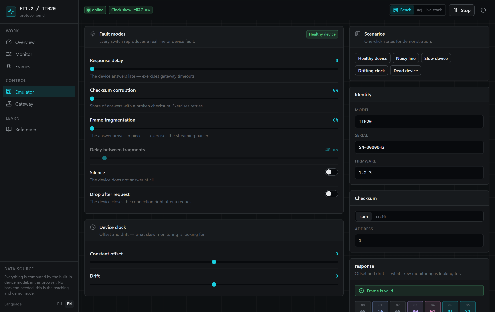

Every switch reproduces a real line or device fault: a late answer, a share of
answers with a broken checksum, an answer that arrives in pieces, silence, and
a connection dropped right after the request. Each one exercises a specific
part of the gateway — timeouts, retries, the streaming parser, reconnect.

The scenario buttons set several at once. This is `Noisy line` being switched
on, and the line degrading under it:

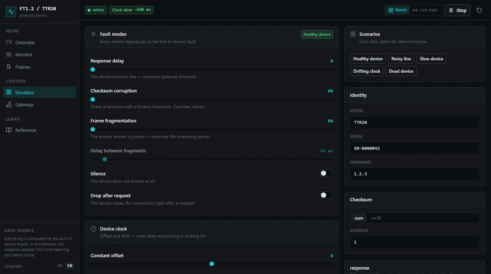

Two of the controls here, the constant clock offset and the drift, are
bench-only. The Go emulator answers with its host's real clock and has nothing
to inject, so on the live source those two sliders are disabled and say why.

## Gateway

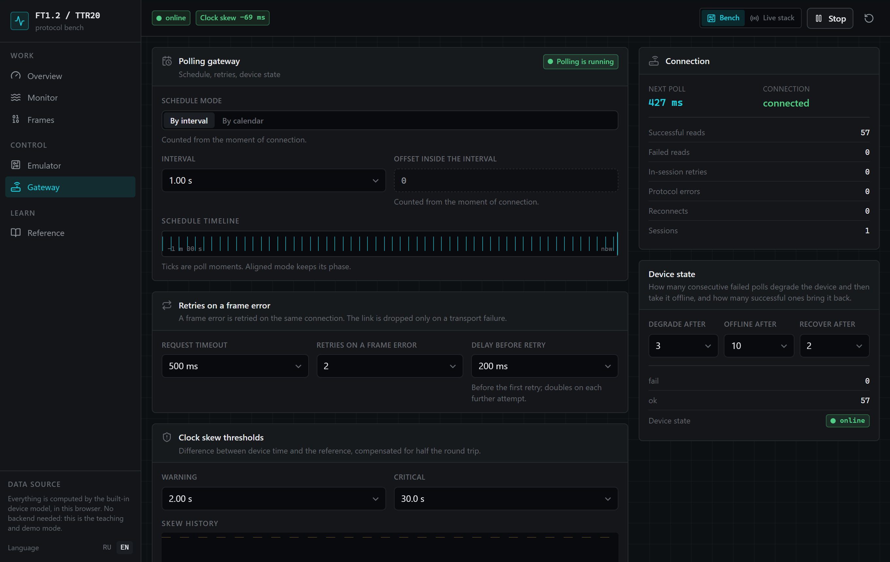

The schedule is the part the brief actually asks for. *By calendar* is an
aligned schedule: poll instants are measured from the epoch, so they land on
the same wall-clock second after every restart and reconnect rather than
drifting by however long each reply took. The shipped default is one minute at
an offset of five seconds — the fifth second of every minute. *By interval* is
a fixed rate from the last poll, phase wherever the connection put it.

Below it, the retry budget is separated from reconnection on purpose: a frame
error is retried on the same connection, and the link is dropped only on a
transport failure.

---

## The same console against a running stack

Switch the source to **Live stack** and the page stops modelling anything.

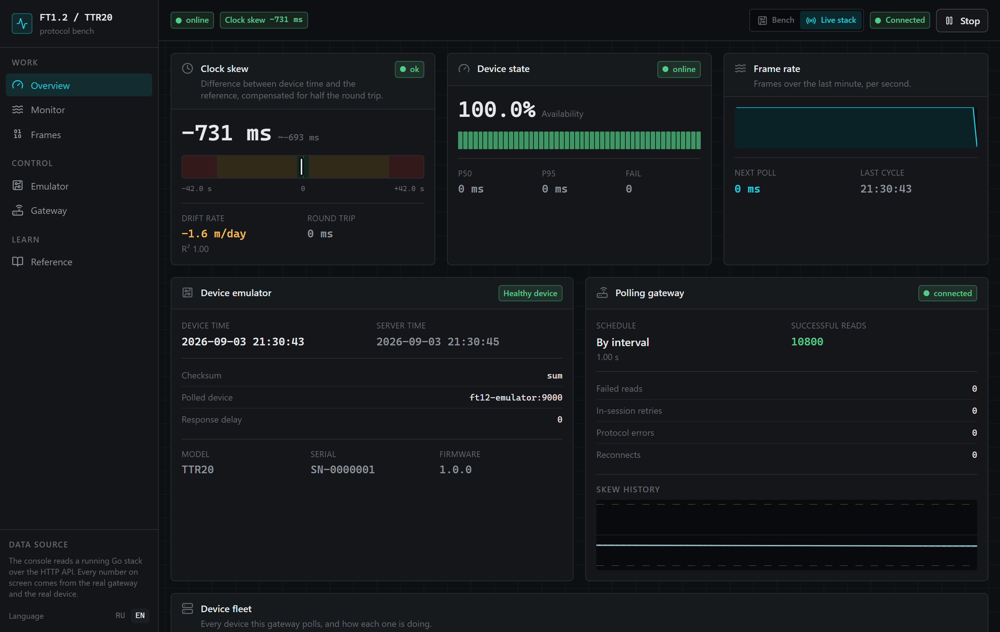

The device is now `ft12-emulator:9000`, the read count is the gateway's own,
and the nameplate under `MODEL` / `SERIAL` / `FIRMWARE` is what the
read-identity probe actually found.

### The fleet

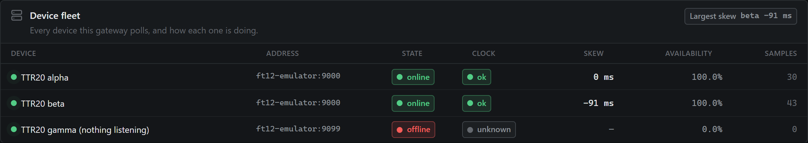

Given a device inventory, one gateway polls many devices, each with its own
schedule, timeouts and thresholds. The third device here is deliberately
pointed at a port with nothing behind it, which is what makes the table worth
looking at: two online, one offline, and the largest skew in the fleet named
rather than left to be found.

A gateway started without an inventory reports a fleet of one, so this view
renders the same either way and a reader never has to ask which mode the
gateway is in.

### Changing the gateway's settings

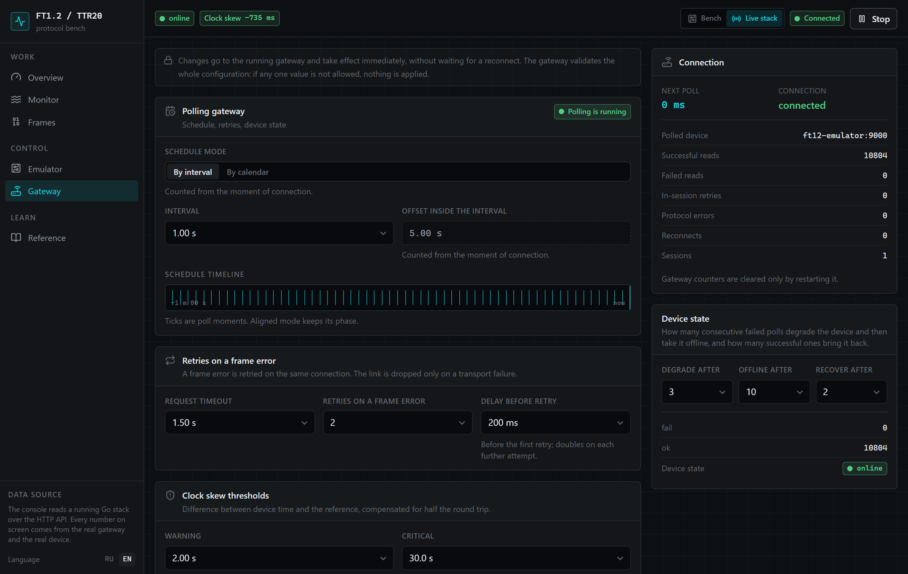

These controls write to the running process. The gateway validates the whole
configuration before applying any of it, so a value it refuses leaves
everything exactly as it was, and the console says why beside the controls.

A schedule change is not queued behind the old interval — a gateway parked on
a one-minute wait re-plans the moment it is told otherwise:

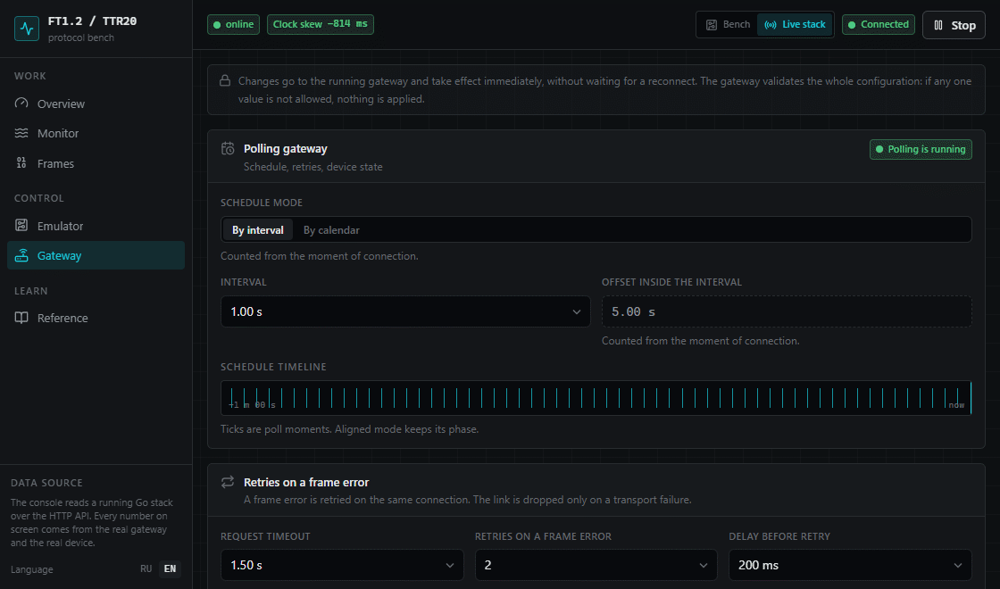

What cannot be changed from here is as deliberate as what can. The target
address, checksum mode and adapter address are identity rather than settings:
change one mid-flight and the frames on the wire stop matching the device. The
clock and health window sizes are absent because resizing a ring buffer throws
away the history someone was reading.

### When nothing is answering

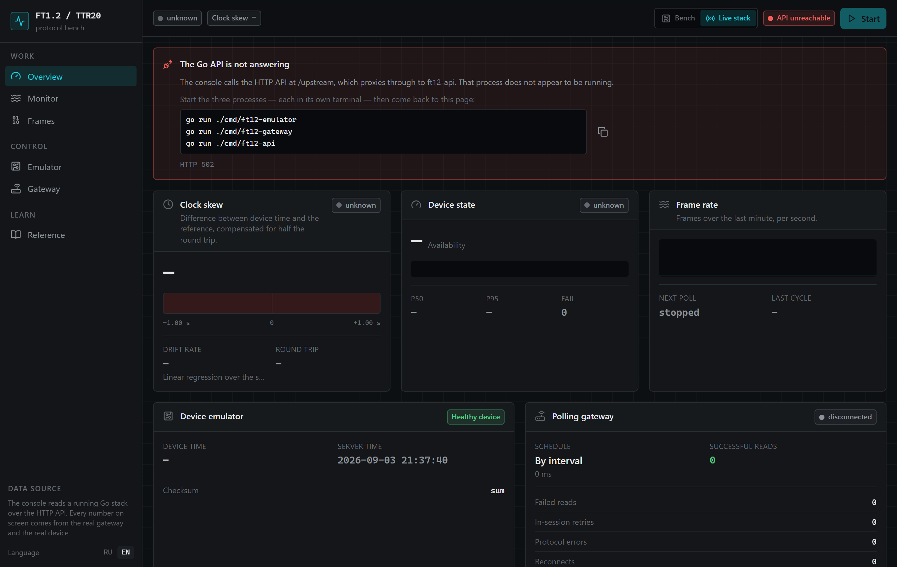

The console says what is missing and how to start it, and shows the HTTP
status it actually got.

What it does not do is fall back to rendering zeros. A page full of zeros is
indistinguishable from a healthy, idle gateway, and confusing those two is the
one mistake a monitoring view must not make.

---

## Seeing it yourself

```sh
docker compose up --build
```

Then open `http://localhost:3000/en`. The whole stack — emulator, gateway, API
and console — comes up together, and the console is already pointed at the
API. See [Docker](docker.md) for the wiring and [Console](console.md) for
running it against processes started by hand.
